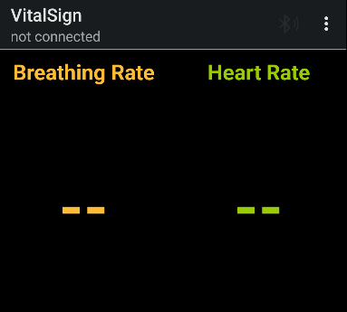

Android BluetoothServer
===================================

Introduction
------------
!! This project is fork by URL: https://github.com/android/connectivity-samples.
This BluetoothServer should be run on Android devices and connect the client which is created by python(no provied code), to establish a two-way transport data over
Bluetooth between the devices. But we only need to transport client data to the server.

Select "Made discoverable" in overflow menu on one device and click
on the Bluetooth icon on the other one, to find the device and establish the connection.
It will display the vital signs extracted from the client.

The sample demonstrates the following, using the [Bluetooth API]:
1. [Setting up] Bluetooth
2. [Querying] the local Bluetooth adapter for paired Bluetooth devices. No need to connect
3. Open discoverable button and wait for the client for 2 min
4. [Establishing RFCOMM] channels/sockets co
5. [Connecting] to a remote device
6. [Transfering] data over Bluetooth

Python client design process.
-------------
sudo pat-get update
sudo apt-get install libbluetooth-dev
sudo pip install pybluez

Start RFCOMM service
sudo sdptool add SP
sudo rfcomm watch hci0

You can follow other operation of this URL: https://github.com/pybluez/pybluez/. It will provide the example of rfcomm-client. 
You can use "uuid" or "address" to connect your server.
TO build your rfcomm-client!.

Pre-requisites
--------------

- Android SDK 21
- Android Build Tools v28.0.3

Screenshots
-------------
 
